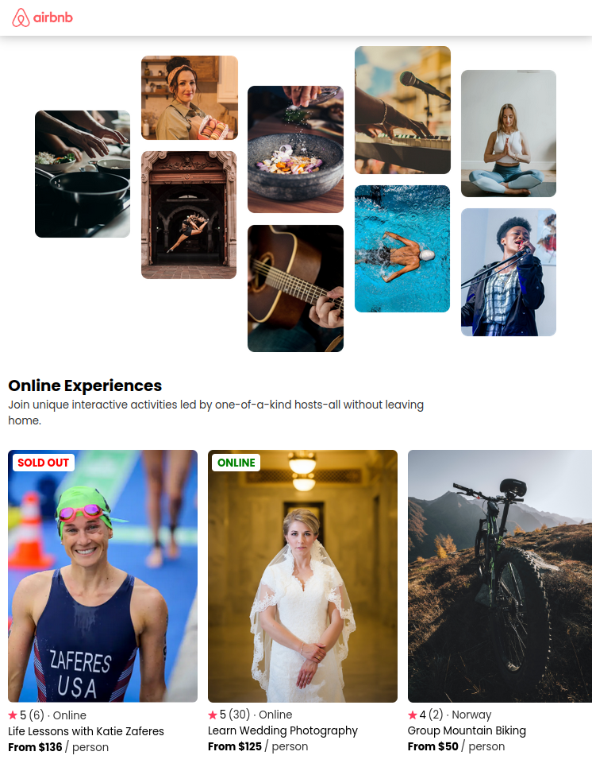

# Airbnb Experiences Clone

A React project mimicking Airbnb's Experiences page.

## Preview

## Running on your machine

To run this project locally, follow these steps:

1. Clone the repository
   (`git clone https://github.com/caiohenrique-3/airbnb-experiences-clone.git`)

2. Navigate to the project directory (`cd airbnb-experiences-clone`)

3. Install dependencies (`npm install`)

4. Start the development server (`npm run dev`)

The project will be accessible at http://127.0.0.1:8080.

## What I learned

In this project, I gained valuable insights into React development by learning
how to effectively use props.

## Acknowledgments

Special thanks to the following resources for their contributions to this
project:

- [React Course](https://youtube.com/watch?v=bMknfKXIFA8)
- [Google Webfonts Helper](https://gwfh.mranftl.com/fonts)

## License

This project is licensed under the [MIT License](LICENSE).

---
